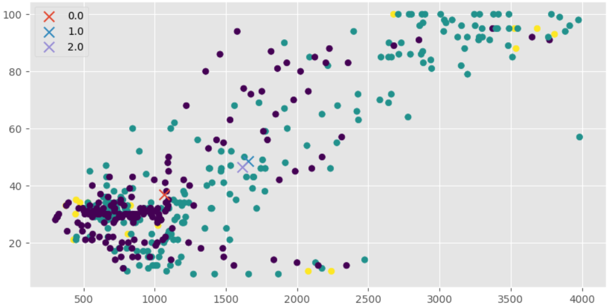

# AutoCloud - A TEDA based algorithm for data clustering.

## Description

The Autocloud is an algorithm for data clustering and classification that employs structures known as data clouds. These data clouds, unlike having pre-defined shapes or boundaries, constitute a collection of data sharing common characteristics in n-dimensional space. In simpler terms, they consist of data points closely aligned within the feature space mapping. Stemming from the equations of TEDA (Typicality and Eccentricity Data Analytics), Autocloud computes the normalized eccentricity for each new sample concerning every existing data cloud.


- [Documentation](#documentation)
- [Usage](#use-case-example)
- [References](#references)
- [License](#license)

## Documentation

The DataCloud class represents an individual DataCloud within the TEDACloud algorithm
1. **DataCloud Class:**

    - **Constructor (`__init__`):** Initializes a new DataCloud object with a specified initial value for the mean (`x`) and an optional key for the point (`point_key`).

    - **`get_updated_mean(x)`:** Calculates the updated mean given a new value (`x`).

    - **`get_updated_variance_k_2(x)`:** Calculates the updated variance using method k=2, based on the new value (`x`).

    - **`get_updated_variance_k_3(x, test_mean)`:** Calculates the updated variance using method k=3, based on the new value (`x`) and a test mean for distance calculation.

    - **`get_number_of_points()`:** Returns the number of points in the DataCloud.

    - **`update_stats(new_mean, new_var)`:** Updates the mean and variance of the DataCloud.

    - **`add_point(new_point)`:** Adds a single point (`new_point`) to the DataCloud.

    - **`add_points(new_points)`:** Adds multiple points (`new_points`) to the DataCloud.

    - **`_adjust_variance(new_point)`:** Adjusts the variance of the DataCloud based on a new point.

    - **`_calculate_force(point)`:** Calculates the 'force' based on the distance of a point to the mean.

    - **`_adjust_variance_with_force(points)`:** Adjusts the variance of the DataCloud based on the total force calculated from a list of points.


&nbsp;

&nbsp;

The TEDACloud class is responsible for managing these DataClouds, creating new clusters, merging clusters based on their intersection, and running the TEDA algorithm either offline or online. Additionally, it offers functionality to display metrics about the DataClouds and to save the assigned data cloud indices for each data point in a DataFrame.

2. **TEDACloud Class:**

    - **Constructor (`__init__`):** Initializes a new TEDACloud object with parameters `m` and `max_clouds`.

    - **`create_cloud(x, verbose=False)`:** Creates a new DataCloud with the given initial mean value (`x`). Optionally, it can print a message if `verbose` is set to `True`.

    - **`delete_cloud(c)`:** Deletes a specific cloud (`c`) from the TEDACloud.

    - **`merge_clouds(c_target, c_source)`:** Merges two clouds (`c_target` and `c_source`) in the TEDACloud, updating their stats and adding new points.

    - **`check_clouds_intersection()`:** Checks for intersection between clouds and merges them if necessary.

    - **`save_result(df)`:** Updates a DataFrame (`df`) with the assigned data cloud indices for each data point.

    - **`display_metrics()`:** Prints the metrics of the TEDACloud instance, including the number of DataClouds, number of points, mean, and variance for each DataCloud.

    - **`print_datacloud_numbers()`:** Prints the number of DataClouds in the TEDACloud.

    - **`run_offline(df, features, m, num_cloud=3)`:** Runs the TEDA algorithm offline on the given DataFrame (`df`) using a list of features, parameter `m`, and a specified maximum number of clouds (`num_cloud`).

    - **`run_online(point, k, m, num_cloud=3, is_outlier=False)`:** Runs the TEDA algorithm online for a single data point (`point`) at time `k`, with parameters `m` and a specified maximum number of clouds (`num_cloud`). The optional parameter `is_outlier` determines if the point is treated as an outlier. Returns the index of the chosen cloud.

&nbsp;

## Use Case Example

Here is an illustrative example of utilizing the TEDACloud class to execute the AutoCloud algorithm offline on a DataFrame containing features derived from data collected from a car by our team. In this particular instance, we have set the parameter `m` to 2 and established a maximum limit of 3 clouds.

The primary objective is to leverage the engine load data, along with another feature named 'areas,' which has been calculated separately during a pre-processing data stage. In this case study, with these two values, our aim is to generate data clusters capable of classifying the driver's behavior.

For a detailed walkthrough of this example, you can refer to the accompanying notebook available [here](https://github.com/conect2ai/Conect2Py-Package/NotebooksAutoCloud_UseCase_Test.ipynb).

### First: Initialise the models.

```python
# initialize the algorithms
teda = TEDADetect()
autocloud = TEDACloud()
outlier_count = 0
outlier_window = 4
k = 1

total_outliers = 0
outliers_resets = 0
teda_flag = []
resets = []
```

### Second: Run the models

In this case we're running the models offline and using the TEDA model from our package to help identify outlier on the data and later decide if we'll keep them.

```python
# iterate over the data
for i, row in area_radar_dataset.iterrows():
    # run teda to verify if the point is an outlier
    outlier = teda.run_online(row[['areas']])

    if outlier:
        outlier_count += 1
        total_outliers += 1
        teda_flag.append(1)
    else:
        teda_flag.append(0)
    
    if outlier_count == outlier_window or not outlier:
        # run autocloud to cluster the points
        cloud_index = autocloud.run_online(row[['areas','engineLoad']], k, 2, is_outlier=outlier)
        
        # get the dataset until the current point
        tmp = area_radar_dataset.iloc[:i+1]
        # autocloud.plot_graph(tmp[['areas','speedOBD']], k)
        k += 1

        # add the index to the row
        area_radar_dataset.loc[i, 'cloud_index'] = cloud_index
    
    if outlier_count == outlier_window:
        outlier_count = 0
        outliers_resets += 1
        resets.append(1)
    else:
        resets.append(0)

autocloud.display_metrics()
```

Note that we used the TEDA model, by running its online version, in this line:
```python
outlier = teda.run_online(row[['areas']])
```

And for the Autocloud model, here is the only thing we need to do to run it online:
```python
cloud_index = autocloud.run_online(row[['areas','engineLoad']], k, 2, is_outlier=outlier)
```
And I seen before, the code above should return the index of the chosen cloud.

---
Well after that you expect to see something like the following informations:
> Number of DataClouds: 3
>
> DataCloud 1:
>
> Number of points: 76
> 
> Points: {1, 4, 5, 6, 7, 8, 9, 10, 11, 12, 13, 389, 143, 391, 392, 399, 400, 402, 403, 404, 23, 405, 25, 26, 27, 28, 406, 407, 289, 290, 291, 292, 419, 420, 421, 422, 423, 424, 390, 425, 46, 47, 430, 433, 434, 435, 439, 312, 313, 314, 315, 316, 334, 335, 336, 87, 88, 89, 221, 222, 223, 352, 353, 354, 249, 250, 110, 239, 240, 251, 246, 247, 248, 121, 122, 123}
> 
> Mean: [565.44361842  29.90789474]
> 
> Variance: 7492.14269136095
> 
> ----------------------------------
> DataCloud 2:
> 
> Number of points: 48
> 
> Points: {257, 2, 258, 4, 5, 6, 7, 8, 9, 10, 11, 12, 13, 261, 143, 264, 265, 23, 25, 26, 27, 28, 260, 300, 301, 46, 47, 302, 303, 321, 87, 88, 89, 343, 346, 221, 222, 223, 349, 229, 110, 121, 122, 123}
> 
> Mean: [4094.28   94.  ]
> 
> Variance: 6219.14707140805
> 
> ----------------------------------
> DataCloud 3:
> 
> Number of points: 25
> 
> Points: {3, 4, 5, 6, 7, 8, 9, 10, 12, 13, 14, 17, 18, 29, 30, 32, 33, 34, 49, 51, 52}
> 
> Mean: [7599.375   90.   ]
> 
> Variance: 3396.0145206771494
> 
> ----------------------------------

### Third: Visualize the results

After some processing of these results, this is what we get to visualize the clusters:

<p align="center">



## References

1. ANGELOV, P. Autonomous learning systems: from data streams to knowledge in real-time. [S.l.]: John Wiley & Sons, 2012.

2. [Silva, M. "Uma metodologia orientada a fluxo de dados para modelagem do comportamento de motoristas" - 2022. Universidade Federal do Rio Grande do Norte. Natal.](https://repositorio.ufrn.br/bitstream/123456789/49439/1/Metodologiaorientadafluxo_Silva_2022.pdf)

3. [Medeiros, M. "Abordagem para avaliar o comportamento do motorista em tempo real com TinyML" - 2023. Universidade Federal do Rio Grande do Norte. Natal.](https://repositorio.ufrn.br/bitstream/123456789/55853/1/tcc_morsinaldo_final.pdf)


## License

This package is licensed under the [MIT License](https://github.com/conect2ai/Conect2Py-Package/blob/main/LICENSE) - © 2023 Conect2ai.